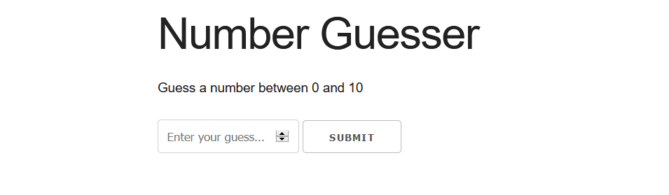

# The Number Guesser Game
This is a number guessing game created using Html, Css, Javascript, and Skeleton

## Developed By
> Nishkarsh Dubb

## Screenshots


## Live Demo 
 [https://nishkarsh01.github.io/the-number-guesser-game/](https://nishkarsh01.github.io/the-number-guesser-game/)
 
 ## Game Logic

- Player must guess a number between the given minimum and maximum numbers
- Player gets a certain amount of guesses
- If the player guesses right number, he wins

## Developed using
* Html
* css
* javascript
* skeleton

## Setup:

#### Clone this repository:

```bash
git clone https://github.com/Nishkarsh01/the-number-guesser-game.git
```
or download the zip file from github.

After extracting the files, 

* 1  .``cd the-number-guesser-game`` 
* 2  .``open index.html``

## Collaborate
To collaborate, reach me on [nishdubb11@gmail.com]()

## Further help

To get more help on the Javascript go check out the [MDN Javascript Documentation](https://developer.mozilla.org/en-US/docs/Web/JavaScript).

